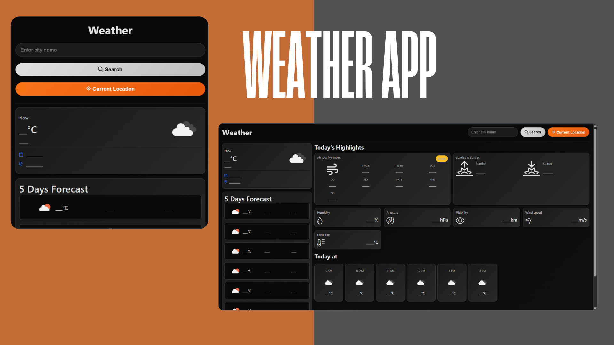

# 🌦 Real-Time Weather Dashboard

A modern, responsive dashboard that displays real-time weather information for any city using the OpenWeatherMap API.

---
## 🌐 Live Demo

👉 [**Demo**](https://tranquil-griffin-c463e4.netlify.app/)

## 📸 Screenshot



---

## 🚀 Features

- 🔍 Search weather by city name
- 🌡 Displays current temperature, weather condition, and icons
- 📅 3-day weather forecast
- 🌐 Detects and shows weather for your current location (if allowed)
- ⏳ Shows loading states for better UX
- 🎨 Clean and minimal UI with pastel-themed styling

---

## 🛠 Built With

- **HTML**
- **CSS**
- **JavaScript**
- **OpenWeatherMap API**
- **Fetch API**

---

## 📦 How to Run Locally

1. **Clone the repository**
   ```bash
   git clone https://github.com/Manailghouri/Real-Time-Weather-Dashboard.git
   cd Real-Time-Weather-Dashboard
